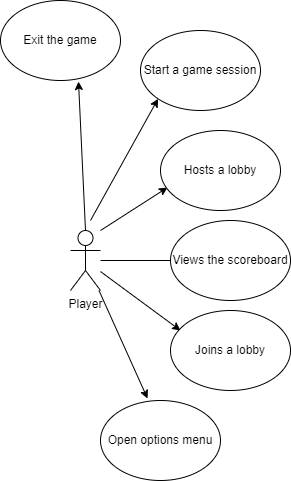
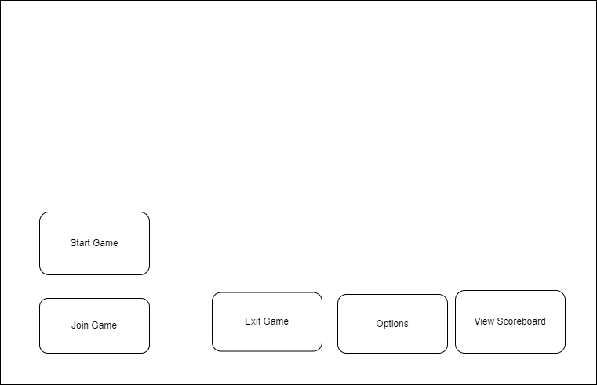
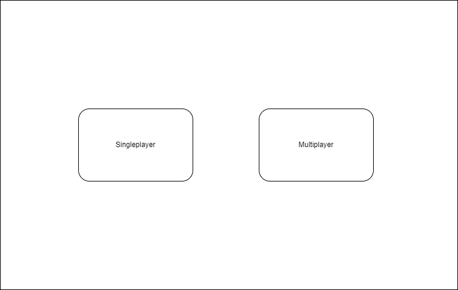

# 1. Postioning

## 1.1 Problem statment
The problem of uninspired, unengaging roguelike video games today affects gamers who are fans of the roguelike genre; the impact of which is a boring, lackluster experience that feels like a waste of time.
## 1.2 Product Position Statement
For gamers who are fans of the roguelike genre who crave that sense of wonder and immersion, Gotta Get Back is a topdown, dungeon crawler roguelike that provides that sense of endearment that's missing in today's roguelike market. Unlike The Binding of Isaac and Enter the Gungeon, our product combines an addictive gameloop with an enthrawling story to create an engaging experience.
## 1.3. Value proposition and customer segment
**Value propostion:** Gotta Get Back is a topdown dungeon crawler roguelike that provides gamers, who are fans of the roguelike genre, a captivating roguelike experience that also immerses the user in a charming story.

**Consumer segment:** Gamers who are fans of the roguelike genre.

# 2. Stakeholders
#### Story Developers
Must develop a compelling story that engages the player by adding depth to characters, items, and the environment; in the best case, this would give the player more insentive to continue playing or return to the game for the story

#### Game Developers
It is the job of game developers to work with the story developers and game designers to understand and help plan the systems that will appear in the game. These systems should be compelling and enhance the gaming experience for players; adding a new dimension to the experience beyond story, and these systems should support the story, exploration, etc.

#### Game Designers
Should develop assets that uphold the story and help player get immersed and invested in the story being told; in addition, to supporting the gameplay elements such as combat.

#### Players
The players rely on the game, story, and design developers to deliver a game that is fun to play and offers something that is not already found in the market. Additionally, it is the job of the player to play the game and give feedback to the developers. Be this feedback for what this could be added or fixed in an update, what could be added in game expansions, or what could be added or done differently in new titles the developing team releases.

#### Clients
Support the developing team in their endeavour to release a polished and engaging game that appeals to the target audience, and help the developing team meet their release deadline. It is also up to a few select clients to devise a way for our game to be found, acquired, and experiences by our players.

#### Competitors
The competitors have the responsibility of trying to one up our develping team by delivering a game to our market that out performs or adds something new to the market. Competitors keep the gaming scene interesting with their new titles and inovations because this competition - the desire to do something unique or better - helps keep the market evolving and offering new fresh experiences to the players.

# 3. Functional requirements (features)
1. multiplayer and single player  
2. fast paced  
3. engaging  
4. challanging  

# 4. Non-functional requirements

1. Secure connection for transmitting credentials
2. High availability and reliability
3. Maintaining high player satisfaction

# 5. MVP
For our minimum viable product we plan on making a very bare bones prototype that is playable. It will contain the ability to move around, shoot enemies,
 destroy enemies and have the ability for multiplayer. Some others things may be added in for testing such as respawning to make our lives and the testers life
 easier but respawing isn'tconsidered a core part of the game. Very minimum art will be included, mainly so the player can see where the eneimes are, identify the
 boundries of the map,idenify players location as well as any friends locations, and any projectile locations. We plan on validating this MVP by doing play tests.
 From this we should we able to idenifty what else needs to be included to make our core game fun as well as identify what we can remove from our MVP to make it
 still fun.

# 6. Use cases

## 6.1. Use case diagram

## 6.2. Use case descriptions and interface sketch

### Use Case: Starting a game session

**Actor:** Player

**Description:** The player starts a game, using it to host the game session for any possible other players.

**Preconditions:** The user owns the game

**Postconditions:** The user can play the game session, either alone or with a group.

**Main Flow:**
 
1. The player starts a game session in the system.
    
2. The player chooses if they want either a single player game or a multiplayer game (Multiplayer leads to hosting a game).
    
3. The system checks if the player has a group that needs to also be a part of the game session.
    
4. The player can play the game, either with a group or alone.

**Alternate flow:**

1. The player could want to stop playing.
    
2. The player quits the session. (Quitting leads to exiting a game)

### Use Case: Exiting a game

**Actor:** Player

**Description:** The player exits the game application

**Preconditions:** The player is currently in the game applications

**Postconditions:** The player is no longer in the game application, and the system disconnects from the player

**Main Flow:**

1. The player wants to leave the game

2. The player exits to the main menu

3. The player chooses the exit game option from the menu

**Alternate flow:**

1. The player closes the application of the game though their machine, not through the game itself

2. The system disconnects from the player automatically, and maintains the player's last saved game.

### Use Case: Open options menu 

**Actor:** Player

**Description:** The player changes the options of the game to fit their liking.

**Preconditions:** The player is currently in the application

**Postconditions:** The player's game is updated to reflect their new option changes.

**Main Flow:**

1. The player wants to alter some of the game options.

2. The player selects the options tab from the player menu (both in a game session and on the main menu).

3. The player alters the options they want to change.

4. The player's game is updated to reflect the option changes. 

### Use Case: Views the scoreboard

**Actor:** Player

**Description:** The player views their own and their friends' score on past levels.

**Preconditions:** The player has to be in the main menu.

**Postconditions:** The score of the player and their friends on previously played levels are displayed.

**Main Flow:**

1. The player selects "View Scoreboard" option.

2. The system checks which levels the player and their friends have played.

3. The system displays the scores of the player and their friends on previously played levels.

**Alternate Flows:**

1. The player and their friends have not played any levels yet.

2. The system displays an empty scoreboard.

### Use Case: Hosting a lobby

**Actor:** Player

**Description:** The player starts a game, using it to host the game session for other players.

**Preconditions:** The user owns the game, and selected the multiplayer option when prompted

**Postconditions:** The user can play the game session with a group.

**Main Flow:**

1. The player chooses a multiplayer game session from the menu.

2. The player then can have other players join their game.

3. The system joins the other players to the host session

4. The player can play the game with a group.

**Alternate flow:**

1. The player wants to exit the multiplayer session

2. The player quits the multiplayer session (Leads to exiting a game).

### Use Case: Connecting to other players

**Actor:** Player

**Description:** The player joins a game hosted by another player

**Preconditions:** The user owns the game and has chosen the "Join Game" option on the main menu

**Postconditions:** The user can play the game session that is hosted by another player with said player.

**Main Flow:**

1. The player chooses the join game option

2. The player specifies the game session they want to join

3. The system connects the two or more players into the game session 

4. The player can play the game with their specified group.

**Alternate flow:**

1. The player could want to leave the game.

2. The player selects the exit to menu option. (Leads to Exiting a game)

# 7. User stories

#### Priority 1: Player
As a Player, I want to player a game so that engage and challenge myself while enjoying a game.

#### Priority 2: Host and Client | Player
As a Host, I want to start an open game so that my friends can connect and share the game experience with me.

As a Client, I want to connect to another's game so that I can enjoy a game with my friend(s).

# 8. Issue Tracker
We will be utilizing GitHub for all issue tracking and team communication. We have created an organization in GitHub which allows all team members access to test repositiries, 
as well as a project board for team communioation. We can track tasks that need to be done on the project board, and create GitHub issues in repositiries as needed. We plan to
use GitHub issues for problems in the code or documentation that need to be resolved.
