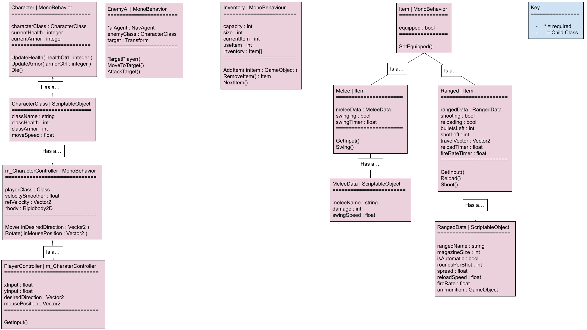

# System Description
For our project, we are developing a game that will help users experience a fun and engaging story with their friends as well as provide a decent framework for other projects we may want to work on in the future. Ideally, the game itself will provide a fun experience as well as give our group a good idea of what we want to create in the future. This game should be able to get us the experience we need to create a decent setup for working on other projects and working with any future developers; however, such a game will be ill equipped to be ported or used on actual consoles, leading to a loss in profits. We will need to be able to expand our overall experience to more popular consoles or platforms so we can be more profitable overall. To avid game fans of 8-bit roguelikes, who want an entertaining experience that they can enjoy with their friends, Project AOTF is a new game that can help you with your dream and provide hours of entertainment. Project AOTF is a top-down dungeon crawling adventure with randomized mechanics, able to provide hours of fun for up to 4 players in one game! This game is a top-down dungeon crawler roguelike that provides gamers, who are fans of the roguelike genre, a captivating roguelike experience that also immerses the user in a charming story. 

In order for this game to succeed, the story developers must develop a compelling story that engages the **player** by adding depth to characters, **items**, and the environment; in the best case, this would give the **player** more incentive to continue playing or return to the game for the story. Likewise, the game developers should work with the story developers and game designers to understand and help plan the systems that will appear in the game. These systems should be compelling and enhance the gaming experience for **players**; adding a new dimension to the experience beyond story, and these systems should support the story, exploration, etc. The game designers should develop assets that uphold the story and help player get immersed and invested in the story being told; in addition, to supporting the gameplay elements such as _combat_ and _movement_. 

The **players** rely on the game, story, and design developers to deliver a game that is fun to play and offers something that is not already found in the market. Additionally, it is the job of the **player** to play the game and give feedback to the developers. Be this feedback for what this could be added or fixed in an update, what could be added in game expansions, or what could be added or done differently in new titles the developing team releases. Whereas the clients support the developing team in their endeavor to release a polished and engaging game that appeals to the target audience, and help the developing team meet their release deadline. It is also up to a few select clients to devise a way for our game to be found, acquired, and experiences by our players.

The competitors have the responsibility of trying to one up our developing team by delivering a game to our market that outperforms or adds something new to the market. Competitors keep the gaming scene interesting with their new titles and innovations because this competition - the desire to do something unique or better - helps keep the market evolving and offering new fresh experiences to the **players**.

We currently have 4 functional requirements for our project: being able to support the multiplayer and single player features of the game, keeping the game at a fast pace to engage the **players**, ensuring that **players** stay engaged over a long period of time, and keeping the game challenging for the **players**, but not excessively difficult. Our non-functional requirements include having a secure connection for transmitting credentials, having high availability and reliability, and maintain player satisfaction.

As for use cases/user stories, most, if not all, of the interactions throughout our system will be between the **player** and the game. Indeed, the **player** will have the ability to do all sorts of things including, but not limited to at the moment: start a game session, host a multiplayer lobby, join a multiplayer lobby, view the scoreboard of past levels, open the options menu and mess with some option parameters, _move within the game session_, manage their **inventory** which will contain either **melee** or **ranged** weapons, use such weapons in order to <ins>defeat **enemies** within said game session</ins>, and to simply exit the game.

# UML Class Diagram for MVP

