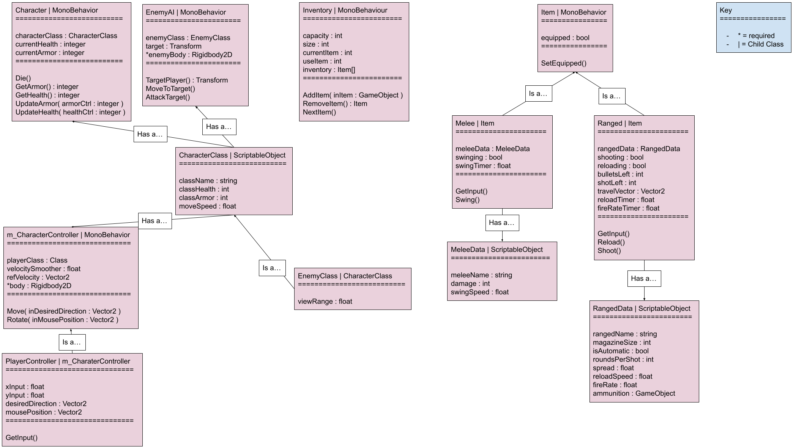

# System Description
The problem of uninspired, unengaging roguelike video games today affects gamers who are fans of the roguelike genre; the impact of which is a boring, lackluster experience that feels like a waste of time. Gotta Get Back is a topdown dungeon crawler roguelike that provides gamers, who are fans of the roguelike genre, a captivating roguelike experience that also immerses the user in a charming story. We are building a 2D platformer game that we hope will entice and engage a wide variety of **players**. The **player** will be able to interact with the level, as well as the various **enemenies** within our game. Our game will include multiplayer functionality to allow for hours of play with friends. 

# UML Class Diagram for MVP

