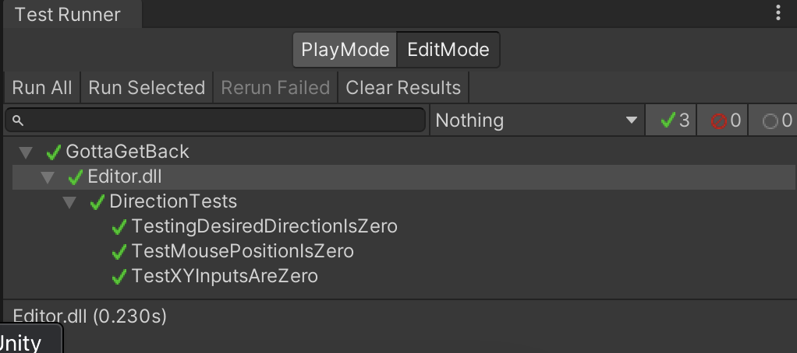
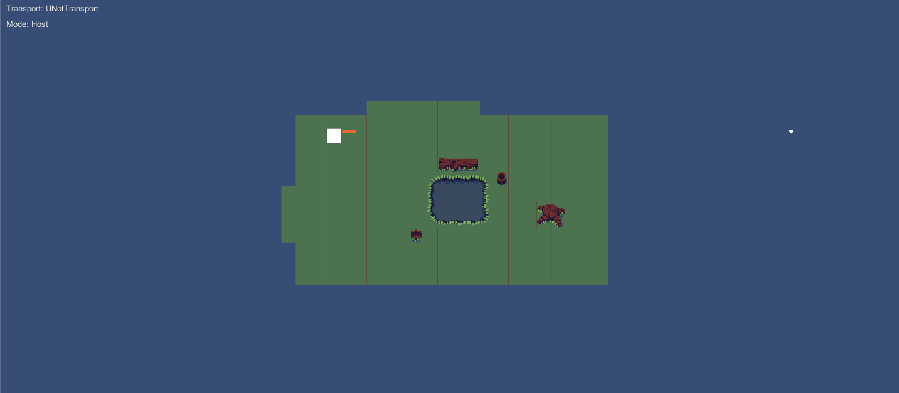

# Deliverable 4

## Introduction

Gotta Get Back is a topdown dungeon crawler roguelike that provides gamers, who are fans of the roguelike genre, a captivating roguelike experience that also immerses the user in a charming story. Or at least, that would be our final goal in terms of delivering a value. Of course, while we have yet to implement most of the features to deliver such a value, the features in our current system are as follows. Currently, our game loop consists of a white square with a gun, controlled by the player, fending off red enemy squares, controlled by the enemy AI system, that periodically spawn as waves attempting to defeat the player. Moreover, our system has multiplayer capabilities that allow players to host or join a game session, all through a simple menu. Here is the github link to our project: https://github.com/CS386-S22-Group1/cs386-project

## Implementation Requirements
**_*We used the GitHub project board, so a link to an issue is not applicable in our case_**

**Requirment:** As a player, I want to move around the environment so that I can out-maneuver the enemies.

**Pull Request:** https://github.com/CS386-S22-Group1/cs386-project/pull/29

**Implented by:** Asa Henry

**Approved by:** Zachary Bryant

===============================

**Requirment:** As a player, I want to shoot projectiles from my ranged weapon so that I can defeat the enemies from a distance.

**Pull Request:** https://github.com/CS386-S22-Group1/cs386-project/pull/33

**Implented by:** Asa Henry

**Approved by:** Zachary Bryant

===============================

**Requirment:** As a Player, I want a game so that I can fill my free time with a fun and challenging activity.

**Pull Request:** https://github.com/CS386-S22-Group1/cs386-project/pull/43

**Implented by:** Asa Henry

**Approved by:** Zachary Bryant

===============================

**Requirment:** As a Host, I want to start a lobby so that my friends can share the game experience with me.

**Pull Request:** https://github.com/CS386-S22-Group1/cs386-project/pull/46

**Implented by:** Asa Henry

**Approved by:** Zachary Bryant

===============================

**Requirment:** As a Client, I want to connect to another's game so that I can join my friend(s) in a game.

**Pull Request:** https://github.com/CS386-S22-Group1/cs386-project/pull/46

**Implented by:** Asa Henry

**Approved by:** Zachary Bryant

===============================

**Requirment:** As a Stylized Player, I want an open environment so that I can approach each situation in my own way.

**Pull Request:** https://github.com/CS386-S22-Group1/cs386-project/pull/30

**Implented by:** Zachary Bryant 

**Approved by:** Asa Henry

## Tests
- Unity has a built in unit testing system called test runner that we are using to make our unit tests.
- https://github.com/CS386-S22-Group1/cs386-project/tree/main/GottaGetBack/Assets/Tests
- We have a unit test to test that our starting positons for the player should be zeroed out as well as the intial x and y input are zeroed out.
- 

## Adopted Technologies
- Unity Framework: The Unity frameowrk is a popular game-building platform that allows users to easily create games using the C# programming language. We chose Unity because several of our team members have experience programming in C#, so we thought this was out best option to reduce the learning curve among our team.

- Unity Netcode: Unity Netcode is an extension to the Unity framework that assists developers in adding multiplayer functionality to their games. Netcode handles all of the network and transporation layers and allows the developer to interect with the library using C# objects.

- C#/Microsoft .NET: Microsoft .NET better known as the C# programming language is used by the Unity framework. All the code for Unity games is written in C# and Unity integrates closely with the Microsoft .NET platform.

## Learning & Training

Our team utilized a variety of resources to learn more about the Unity platform and C# in general, as well as how specific mechanics were going to be applied to our game. Because our team members had varying levels of familiarity with both Unity and C# in general, we all tended to use resources aimed at our specific skill level. We used resources from Udemy, YouTube, the Unity documentation, and more.

Specific Resources Used:
- DapperDino Unity Multiplayer Series (https://www.youtube.com/watch?v=4Mf81GdEDU8&list=PLS6sInD7ThM2_N9a1kN2oM4zZ-U-NtT2E)
- Unity HelloWorld Netcode Tutorial (https://docs-multiplayer.unity3d.com/docs/develop/tutorials/helloworld/helloworldintro/index.html)
- Unity Documentation (https://docs.unity3d.com/Manual/index.html)
- GitHub Documentation (https://docs.github.com/en)
- Velvary Unity Tile Tutorial (https://www.youtube.com/watch?v=DTp5zi8_u1U&t=175s)

## Deployment

Our project does not follow the "traditional" deployment process because our application is designed to only run on the end user's machine. Our multiplayer functionality does not require a stand-alone server, so there are no resources or servers that need to me maintained and updated by our team. Our deployment process would include creating a new build of our game for the platforms we want to release to (Windows, MacOS, etc.) and making the executable file available to the public via a file server or some other means.

## Licensing

## README File

## Look & Feel
- As of right now our MVP is very simple in terms of design and apperance. We wanted to keep our design very minimal and simple so after we have made an MVP that has a solid base we could start working to add sprites/tilemaps/animations and other elements to give the game a more unquie and sytlized fell. For the actual feel we worked on giving the user a very smooth feeling when using the player character. Again we didn't want to make too many choices early on so we gave our player simple but smooth movement and a projectile that has a simple projectile. We plan on our next build making our player have a more stylized fell and design.

## Lessons Learned
- As far as learning about the game engine we've learned a lot about having to work with networks to make multiplayer. Learning about how the client and host interact with the server and how to handle certain events show as player movement being translated to other clients. As A team we've learned that we should start working on our processes very early this way we can understand the scope of the issue. With our multiplayer and unit testing we started both of these lates and had to work over time to get them done. We've also learned that it's important that everyone has enough of an understanding of each section of the game so they can develop properly in it. Such as Zack trying to implement online but not having a strong grasp of Asa's player controller and not being able to work as efficiently because of it. This we can remedy by either having better communication or having good documentation of each other's functions.

## Demo

Our demo video can be found here: [Gotta Get Back Demo Presentation](D4_MVP_Video/Gotta_Get_Back_MVP_video_presentation.mp4)

You will probably have to download the video file. Use the "Download" button, or the "View raw" link that are on the screen.

In the demo video, presented by Asa Henry, it is shown how a player is able to use a simple UI from the "Building on 'Hello World'" tutorial that Unity Netcode team created to start a "Host", a "Client", or a "Server" instance.

Preceeding through the video, the first thing that is pointed out is the consistency between the Host and Client instances. Both instances show the Host and Client player objects; and when an enemy is on the screen of one player, the other is also able to see it, and it's position is consistent across both instances.

Looking further into this, Asa explains, in some detail, that the group developed an enemy spawning system the implements enemy waves, similar to something you might see is Call of Duty zombies, and this is to help players not become overwhelmed by enemies as they test and play.

Talking further, it is also shown off how enemies are able to target a player, and which player they are focused on is indicated by their rotation. As well as, how they move across the world space.

Penultimately, player engagement with enemies is far from complete. Most notably from the video, the rotation of the player object is fixed, facing in the positive x-direction. At one point, we had the player object tracking the mouse; however, when trying to implement this just for the Host, it became apparent that Unity was incorrectly having the player object track the camera that was intentended to capture mouse position, and translate that to a position in world space. Very annoying, as mentioned, but this will definitely be a top priority for our next version. Additionally, we tried to apply the same technique for single player when translating to multiplayer, so that could have been a massive problem.

Finally, ranged weapons are discussed; more specificall, how ranged weapons have a set number of "bullets" or "pellets" to launch before having to reload. In the future, idealy the player would have some sort of UI to count their remaining pellets before having to reload.

As an after thought, respawning was implemented; however, over the course of the past couple of days, respawning was turned off and fell to the way side in favor of getting the Host and Client instances to match up, and to implement enemy spawning. In future version, if a player would be defeated by an enemy, a respawn button would be presented to them; therefore, allowing the player to rejoin the session.

