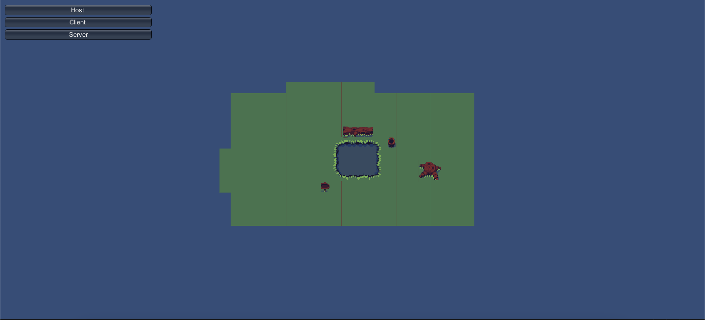

# Deliverable 4

## Intriduction

## Implementation Requirements

## Tests
- Unity has a built in unit testing system called test runner that we are using to make our unit tests.
- https://github.com/CS386-S22-Group1/cs386-project/tree/main/GottaGetBack/Assets/Tests
- We have a unit test to test that our starting positons for the player should be zeroed out as well as the intial x and y input are zeroed out.
- 

## Adopted Technologies
- Unity Framework: The Unity frameowrk is a popular game-building platform that allows users to easily create games using the C# programming language. We chose Unity because several of our team members have experience programming in C#, so we thought this was out best option to reduce the learning curve among our team.

- Unity Netcode: Unity Netcode is an extension to the Unity framework that assists developers in adding multiplayer functionality to their games. Netcode handles all of the network and transporation layers and allows the developer to interect with the library using C# objects.

- C#/Microsoft .NET: Microsoft .NET better known as the C# programming language is used by the Unity framework. All the code for Unity games is written in C# and Unity integrates closely with the Microsoft .NET platform.

## Learning & Training

Our team utilized a variety of resources to learn more about the Unity platform and C# in general, as well as how specific mechanics were going to be applied to our game. Because our team members had varying levels of familiarity with both Unity and C# in general, we all tended to use resources aimed at our specific skill level. We used resources from Udemy, YouTube, the Unity documentation, and more.

Specific Resources Used:
- DapperDino Unity Multiplayer Series (https://www.youtube.com/watch?v=4Mf81GdEDU8&list=PLS6sInD7ThM2_N9a1kN2oM4zZ-U-NtT2E)
- Unity HelloWorld Netcode Tutorial (https://docs-multiplayer.unity3d.com/docs/develop/tutorials/helloworld/helloworldintro/index.html)
- Unity Documentation (https://docs.unity3d.com/Manual/index.html)
- GitHub Documentation (https://docs.github.com/en)
- Velvary Unity Tile Tutorial (https://www.youtube.com/watch?v=DTp5zi8_u1U&t=175s)

## Deployment

Our project does not follow the "traditional" deployment process because our application is designed to only run on the end user's machine. Our multiplayer functionality does not require a stand-alone server, so there are no resources or servers that need to me maintained and updated by our team. Our deployment process would include creating a new build of our game for the platforms we want to release to (Windows, MacOS, etc.) and making the executable file available to the public via a file server or some other means.

## Licensing

## README File

## Look & Feel
- As of right now our MVP is very simple in terms of design and apperance. We wanted to keep our design very minimal and simple so after we have made an MVP that has a solid base we could start working to add sprites/tilemaps/animations and other elements to give the game a more unquie and sytlized fell. For the actual feel we worked on giving the user a very smooth feeling when using the player character. Again we didn't want to make too many choices early on so we gave our player simple but smooth movement and a projectile that has a simple projectile. We plan on our next build making our player have a more stylized fell and design.

## Lessons Learned
- As far as learning about the game engine we've learned a lot about having to work with networks to make multiplayer. Learning about how the client and host interact with the server and how to handle certain events show as player movement being translated to other clients. As A team we've learned that we should start working on our processes very early this way we can understand the scope of the issue. With our multiplayer and unit testing we started both of these lates and had to work over time to get them done. We've also learned that it's important that everyone has enough of an understanding of each section of the game so they can develop properly in it. Such as Zack trying to implement online but not having a strong grasp of Asa's player controller and not being able to work as efficiently because of it. This we can remedy by either having better communication or having good documentation of each other's functions.

## Demo
