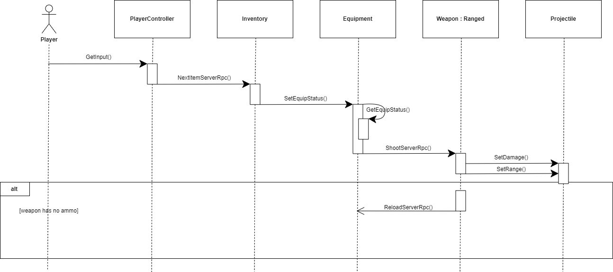

# Project AOTF - Deliverable 5 (Design)

## Description
Gotta Get Back is a 2D top-down game built using the Unity game framework. Gotta Get Back is a dungeon style game where players can explore an open world map and complete different quests.
By using the Unity framework we were able to easily create new game objects as well as build on code made available to us through the Unity community. The Unity framework uses the C# programming
lanaguage which allows all of our team members to assist with coding because C# is a OOP language very similar to Java which we had all used from courses at NAU. Unity simplipies the integration 
between the functional and artistic portions of our project and allows us to easily get an overview of our project in an easy-to-use visual editor. 

Because Unity uses C#, an OOP based language, we were able to easily apply many of the design principles being discussed in class. Unity allows us to link C# files to certain game objects which allows
us to easily break code out into smaller, more managible files or segments. Priniples of OOP allow us to easily create interfaces for common components such as a player or enemy because these objects
share many of the same properties and functions.

## Architecture
The system architecture refines itself to be modular, allowing a program to know exactly where each structure and item is. We designed it to create distinct objects for the program to focus on. We have the player, enemies, ranged and melee weapons, and we would like to add in abilities and armor later, so we created our program to make sure that it successfully implements each item with all of the correct attributes, as well as be added to in the future.

## Class Diagram

## Sequence Diagram
### Use Case: Shoot Ranged Weapon
**Actor:** Player

**Description:** The player presses the attack button to shoot a projectile from their ranged weapon.

**Preconditions:** The player has a ranged weaponed equiped with ammo left.

**Postconditions:** A projectile is launched from the ranged weapon.

**Main Flow:**

1. The player equips a weapon of ranged type.

2. The system checks off the weapon's equiped flag.

3. The player presses the attack button.

4. The system spawns a projectile with a set of values (damage, time, range)

5. The projectile flies across the screen.

**Alternate flows:**

4a. The weapon has no ammo left.

5. The player reloads the ranged weapon.

6. The use case starts over.

---

---

## Design Patterns

### Structural Pattern (Inheritance)

## Design Principles

### - Single responsibility principle
- We can see our game following the practice of single responsibility if we take a look at our player class. In our player class we only have things pertaining to stats of the characters, such as health, armor, damage and movement speed. While others elements can be added to our player class we would start escaping single responsibility. Such as if we added movement to the player in the player class. While this may seem like a good idea at first since our player has the option to move we have now introduced the player class containing being responsible of stats for the player and responsible for moving the player. We can see here that these are two responsibilities and not one. For movement we have a script that can be attached to our player instead, which allows us not only to have clear separation of responsibilities but promotes modularity since we can reuse the movement script if needed.

### - Open/closed principle
- An example of open close can also be seen with our player prefab. Our player prefab at its core is just a rigidbody that we are able to extend with other scripts. We've extended the prefab to the point where it can move, shoot, and have a connection to a server. So while we are able to keep our player open and allow extensions we’re are also not allowing the rigid body to be directly modified.

### - Liskov substitution principle
- We can see the Liskov substitution principle being used in our player prefab and enemy prefab. They both inherit from the character class but have their own unique classes. We are able to swap these subtypes and not have any conflicting issues since both of these classes only extend off of the character and do not directly change or modify the character class.

### - Interface segregation principle
- Once again with our character class, enemy class and player class we have only the necessities for each class. The character class does not extend any functionality that the player class would not use and the same goes for the enemy class.

### - Dependency inversion principle
- As of right now we haven't had a chance to use the dependency inversion principle. We can use some type of player tracker script that would take the stats of the player such as current movement speed, current health, current weapon and we are able to broadcast these traits to whatever script or component would need to view these details. This way we don't have to have the components directly accessing our player or enemy prefabs but we can still translate their details.
=======
