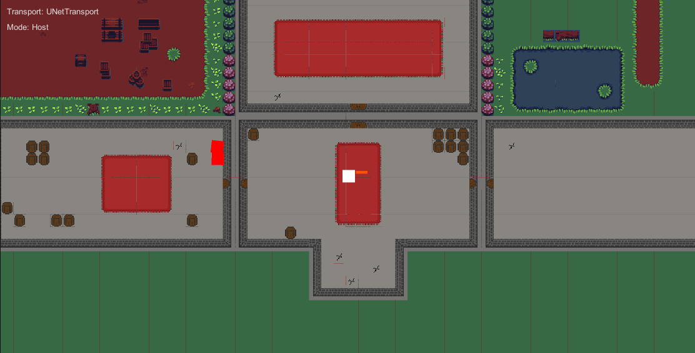

# Project AOTF - Deliverable 6 (Implementation 2)

## Introduction
Gotta Get Back is a topdown dungeon crawler roguelike that provides gamers, who are fans of the roguelike genre, a captivating roguelike experience that also immerses the user in a charming story. Or at least, that would be our final goal in terms of delivering a value. Of course, while we have yet to implement most of the features to deliver such a value, the features in our current system are as follows. Currently, our game loop consists of a white square with a gun, controlled by the player, fending off red enemy squares, controlled by the enemy AI system, that periodically spawn as waves attempting to defeat the player. Moreover, our system has multiplayer capabilities that allow players to host or join a game session, all through a simple menu.

Here is the github link to our project: https://github.com/CS386-S22-Group1/cs386-project

## Implemented Requirements
**Requirement**: As a player I want to have a map to play on.
**Pull Request**: https://github.com/CS386-S22-Group1/cs386-project/pull/81
**Implemented By**: Brian Ruiz & Zachary Bryant
**Approved By**: Sam Gerstner

-*-*-*-*-*-*-*-*-*-*-*-*-*-*-*-*-*-*-*-*-*-*-*-*-*-*-*-*-*-*-*-*-*-*-*-*-*-*-*-*-

**Requirement**: As a player, I want to be able to have my own view of the game in multiplayer.
**Pull Request**: https://github.com/CS386-S22-Group1/cs386-project/pull/80
**Implemented By**: Zachary Bryant & Lenin Valdivia
**Approved By**: Sam Gerstner

-*-*-*-*-*-*-*-*-*-*-*-*-*-*-*-*-*-*-*-*-*-*-*-*-*-*-*-*-*-*-*-*-*-*-*-*-*-*-*-*-

## Tests
- Unity has a built in unit testing system called test runner that we are using to make our unit tests.
- https://github.com/CS386-S22-Group1/cs386-project/tree/main/GottaGetBack/Assets/Tests
- We have a unit test to test that our starting positons for the player should be zeroed out as well as the intial x and y input are zeroed out.
- 

## Demo
https://youtu.be/FR0eOLIDCVU

## Code Quality

#### Policies
Our general policy involved writing code in the interest of getting a working product. This means everyone was able to write with their own style; however, an emphasis was put on the 80 characters per line limit we have been practicing at NAU thus far.

In the event that a line was needed to be broken up:
- mathematical operations should be broken up at the operator, or before; character limit permiting
- conditionals should be broken up at or before the conditional operator; character limit permiting
- method and constructor calls were to be broken up at the comma

#### Conventions
Since we were working with the Unity Necode solution to attain a multiplayer game, we adopted the convention for Server RPC and Client RPC methods.
- Client RPC methods should end with "ClientRpc"
- Server RPC methods should end with "ServerRpc"

#### Best Practices
Variables:
- All variables needed for a class were to be declared and/or initialized at the beginning of the class
  
- All varaibles needed to have a short description of their place/use by the class, as well as any other information that may be helpful in idnetifying
  their use
  
- Variables should be grouped by their place; for example, all timers should be grouped together, and be headed under "Timers"; or something of that
  nature
  
Custom Methods:
- All custom methods were to be declared and/or implemented below any implementation of Unity's defined methods, such as "Start()" and "Update()"

- All custom methods were to be ordered by name, in alphabetical order

- All custom methods should be documented with a short description of their place in the class, as well as any remarks from the programmer; and every
  method should have a short description of their parameters

## Lessons Learned
