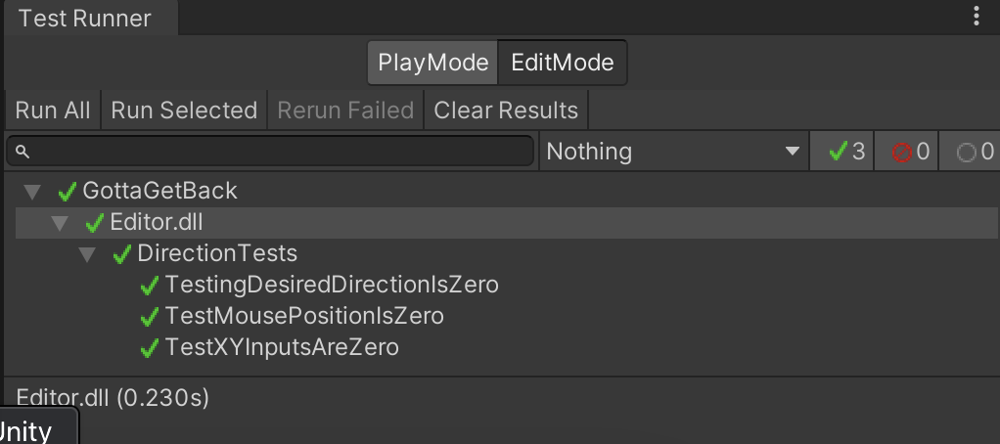

# Deliverable 7 (Verification & Validation)

## Description
Gotta Get Back is a topdown dungeon crawler roguelike that provides gamers, who are fans of the roguelike genre, a captivating roguelike experience that also immerses the user in a charming story.
Or at least, that would be our final goal in terms of delivering a value. Of course, while we have yet to implement most of the features to deliver such a value, the features in our current system are as follows.
Currently, our game loop consists of a white square with a gun, controlled by the player, fending off red enemy squares, controlled by the enemy AI system, that periodically spawn as waves attempting to defeat the player.
Moreover, our system has multiplayer capabilities that allow players to host or join a game session, all through a simple menu.

Here is the github link to our project: https://github.com/CS386-S22-Group1/cs386-project

## Verification (Tests)
### Unit Test
- Unity has a built in unit testing system called test runner that we are using to make our unit tests.
- https://github.com/CS386-S22-Group1/cs386-project/tree/main/GottaGetBack/Assets/Tests
- We have a unit test to test that our starting positons for the player should be zeroed out as well as the intial x and y input are zeroed out.
- 

### Acceptance Test

## Validation (User Evaluation)
### Script
Q1: What do you believe are the strong points of our game?
Q2: What do you believe are the weak points of our game?
Q3: Do you believe that you would enjoy this game, if development continued in the current direction?
Q4: What suggestions do you have to improve our game?
### Results
Kailia L:
Q1: Liked the physics engine and that the game felt very smooth. The art in the game looks pretty good and a liked that there's some multiplayer elements.
Q2: Not a lot of content. Lacking game mechanincs and feels very barebones. Doesn't stand out much.
Q3: No since she isn't into top down shooters but would play it since she is friends with me.
Q4: continuing delveopment and trying to add more content that makes it different then other games on the market.

Vicente C:
Q1: The art style fit well with the view chose (2D). Projectile based weapons add another dimension of difficulty beyond the point-n-shoot of other games with projectile weapons.
Q2: Lack of a main menu, and inability to rotate the player object - made defeating enemies very difficult.
Q3: Vicente was interested in future plans, and would definitely give a more complete version a try.
Q4: Have a chance for players to get unique/rare gear for completing the final wave of enemies.

Ender:
Q1: Combat is probably the strongest point, and the multiplayer.
Q2: Not being able to rotate makes the game unnecessarily hard. No choice in play style.
Q3: Ender did not believe they would enjoy the game because they enjoy games in the third or first person view, and likes games with more indepth character building than a roguelike can offer
Q4: Do some sort of story telling through the environment.

## Reflections

### Features that worked well:

While the multiplayer kind of messed everything up, it still functions as expected in the sense that player instances are synced.

The combat also turned out well. Mainly, the structure of weaopns turned out well because we were able to identify a lot of generic things that is common among all weapons, such as attack rate, so we put those attributes in a high level class; then we extended the functionality, and sectioned off ranged and melee, by deriving child classes to add any missing attributes, references, and added the code to simulate the behavior.

### What can be changed:

The architecture for multiplayer can be spruced up and more clearly defined since we ended up adapting all of our scripts to they can work across a network instead of doing upfront planning for how to structure the classes for multiplayer in the first place.

Player control needs to be improved and better designed for multiplayer since we had to forego rotation because of our time constraint.

Enemy AI can also be improved with more sophisticated path finding toward a targetted player, and more complex behavior.
